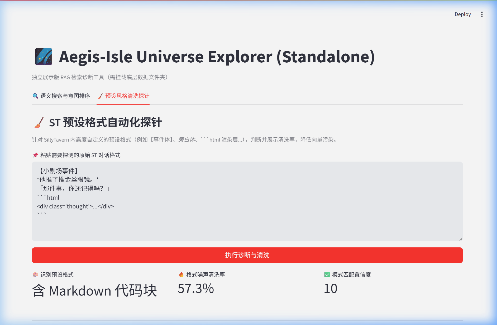

# 🌌 Aegis-Isle Universe Manager (Standalone)

*Read this in other languages: [English](#english) | [中文](#中文)*

---

## 中文

Aegis-Isle Universe Manager 是一款专为 **SillyTavern 长时角色扮演生态** 打造的 RAG (Retrieval-Augmented Generation) 独立诊断看板与意图重排工具。

当角色的“剧情副本次数”（Worldlines / Universes）呈指数级增长时，底层的碎片化记忆搜索往往会遇到两大痛点：
1. **输入意图宽泛导致召回精准率下降** (Intent Ambiguity)
2. **重度自定义的 RP 排版风格污染向量库** (Markdown / HTML Noise Pollution)

该工具作为 Aegis-Isle 主生态的外挂式 Dashboard，完美解决了在庞大历史数据中进行多路并发检索、意图提取以及数据清洗的问题。

> 💡 **项目说明：完全独立开发与架构地位**
> 
> 本项目 (`Universe-Manager`) 及其依赖的大型基础微服务并发 RPG 生态库 **[Aegis-Isle]**，**均由我个人基于从 0 到 1 架构并独立开发完成**。
> 
> 随着 Aegis-Isle 内部 Agent 业务的逐渐复杂化（包括长期记忆流、角色仿真逻辑注入等），将其自身功能用于查错变得越来越繁重。因此，为了体现良好的解耦思维 (Decoupling)，我将核心的 **RAG 向量加载、相似度计算与脏数据清洗算法** 剥离出来，用极轻量级的 FastAPI + Streamlit 单独组建了这个仅用于读操作的“数据旁路监控舱”，无需启动庞大的主项目即可独立调试算法效果。

### 🔥 核心特性
1. **🔍 跨宇宙语义搜索验证与重排 (Cross-Universe Search & Re-ranking)**
   * **并发多路召回 (Parallel FAISS Retrieval)：** 底层挂载海量独立向量库，通过轻量级 FastAPI 拉起底层异步任务组平行索引，毫秒级召回目标剧情。
   * **基于意图快捷种子的高效匹配 (Intent Query Enhancement)：** 提炼意图种子辅助大模型改写模糊的 Query。
   * **人机协作排序 (Human-in-the-loop Re-ranking)：** 召回结果得分基于 `Final Score = Vector Similarity * (1 - ω) + Human Feedback * ω` 进行混合重排。
   
   

     
   

2. **🧹 数据探针与结构化清洗 (Data Diagnostic & Cleaning)**
   * **自动化探针侦测：** 识别诸如 *动作外框*、`【剧场体标签】`或前端 ``html`` 渲染废料，保护 Embedding 向量空间。
   * **高纯度萃取率对比：** 分析原数据与去除噪声后保留极高信息熵文本的“实时清洗率 (Clean Rate)”。

   

     
   

### 🚀 快速启动
1. `pip install -r requirements.txt`
2. 拷贝并部署 `.env` 指向你的 Aegis-Isle 数据主目录。
3. 终端 1：`python api_app.py`  终端 2：`streamlit run dashboard.py`

---

## English

Aegis-Isle Universe Manager is a standalone RAG Diagnostics Dashboard and Intent Re-ranking tool explicitly designed for the **SillyTavern long-term Role-Playing ecosystem**.

When handling an exponentially growing number of character "Worldlines" or "Universes", fragmentary memory retrieval often faces two central pain points:
1. **Intent Ambiguity:** Broad query inputs drastically lowering recall precision.
2. **Noise Pollution:** Heavily customized formatting (e.g., Markdown/HTML) polluting the Vector Space.

Acting as a loosely coupled dashboard for the Aegis-Isle ecosystem, this tool flawlessly resolves parallel cross-universe retrieval, intent phrasing, and structural data cleaning issues across vast historical archives.

> 💡 **Disclaimer: Independent Development & Architectural Position**
> 
> This project (`Universe-Manager`) and its foundational large-scale microservice RPG concurrency ecosystem **[Aegis-Isle]** were **both fully conceived, architected from scratch (0-to-1), and independently developed by me**.
> 
> As Aegis-Isle's internal Agent capabilities (like long-term data streams and character simulation injection) became more interwoven, using its monolithic body to run isolated algorithm diagnostics became burdensome. Promoting robust **Decoupling capabilities**, I extracted the core **RAG loading, FAISS similarity compute, and data-cleaning algorithms** into this ultra-lightweight FastAPI + Streamlit "sidecar dashboard". 

### 🔥 Core Features
1. **🔍 Cross-Universe Semantic Search & Re-ranking**
   * **Parallel FAISS Retrieval:** Pulls up hundreds of independent FAISS index bases using blazing-fast Async task concurrency, bypassing the need to wake up the main agent loops.
   * **Intent Query Enhancement:** Implements quick UI "Seed phrases" to classify common user recall patterns.
   * **Human-in-the-loop Re-ranking:** Results are presented using a hybrid approach balancing local algorithmic accuracy with explicit usage history: `Final Score = Vector Similarity * (1 - ω) + Human Feedback * ω`.
   
   

     
   

2. **🧹 Data Cleaning & Pre-processing Diagnostic**
   * **Noise Probe Automation:** Prevents embedding distortion by identifying complex custom RPG formats (`*actions*`, `[forums]`, or HTML).
   * **Clean Rate Extraction:** Measures text structural integrity and returns clear previews mapping exactly how the context gets sanitized while locking in high information entropy before entering the database.

   

     
   

### 🚀 Quick Start
1. `pip install -r requirements.txt`
2. Setup your `.env` to point `AEGIS_DATA_PATH` to the parent Aegis-Isle `/data` directory.
3. Terminal 1: `python api_app.py` | Terminal 2: `streamlit run dashboard.py`

---
*Architected and Independently Developed as part of the Aegis-Isle project ecosystem for scalable RP memory management.*
